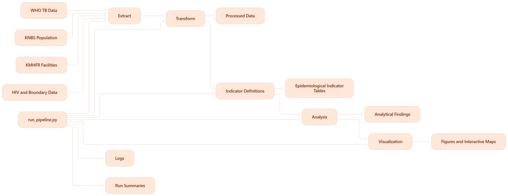
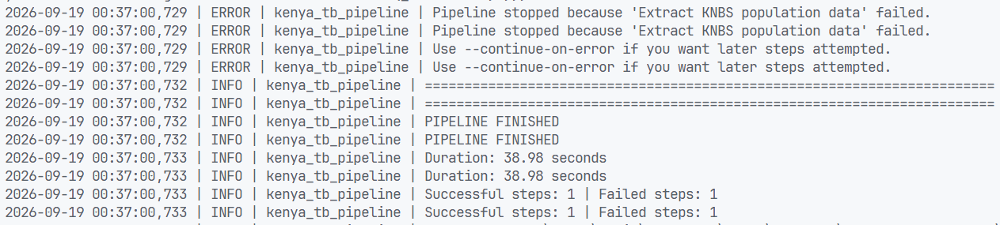

# Kenya TB Surveillance Analysis
## Examining national TB burden, notification gaps, treatment outcomes, TB/HIV indicators and county health-service context using reproducible public data pipelines.
## Wayne Willis Omondi

A reproducible public-health data analysis project that brings together tuberculosis surveillance, population, health-facility and supporting contextual data to examine TB burden, case notification, treatment outcomes, TB/HIV indicators and geographic service context in Kenya.

The project is designed as a portfolio case study in public-health analytics. It goes beyond exploratory charts by separating data extraction, transformation, indicator definition, analysis and visualization into reusable modules.

---

## Project overview

Tuberculosis remains a major public-health concern, and programme monitoring depends on more than counting reported cases.

A useful TB analysis should be able to answer questions such as:

- How has estimated TB burden changed over time?
- How do notifications compare with estimated incidence?
- Is the gap between estimated disease burden and notified cases narrowing?
- How have treatment outcomes changed?
- What does the TB/HIV picture look like?
- How does health-service availability vary across counties?
- Where are data limitations preventing stronger conclusions?
- Which findings are descriptive, and which require more detailed programme data before they can support operational decisions?

This project builds a reproducible analytical pipeline around those questions.

The current version focuses primarily on national TB trends and county-level contextual analysis. County-level TB burden is included only when genuine subnational programme data are available. The project deliberately does not infer county TB burden from national estimates.

---

## Why this project

Many portfolio analyses begin with a cleaned CSV and move directly to charts.

That hides much of the work that matters in real public-health analytics:

- locating reliable sources,
- working with APIs and downloadable administrative data,
- documenting provenance,
- handling inconsistent geography names,
- validating denominators,
- distinguishing modelled estimates from observed programme data,
- defining epidemiological indicators consistently,
- checking data quality,
- and keeping analytical logic reproducible.

This project treats those steps as part of the analysis rather than invisible preparation.

The workflow is:

```text
Public data sources
        ↓
     Extract
        ↓
    Transform
        ↓
    Indicators
        ↓
     Analysis
        ↓
 Visualization
        ↓
   Case study
```



---

# Analytical questions

The case study is organised around five main questions.

## 1. How has TB burden changed in Kenya?

The national analysis examines long-run TB indicators such as:

- estimated incidence,
- estimated mortality,
- case notifications,
- notification rates,
- treatment outcomes,
- TB/HIV indicators,
- and other available programme measures.

The goal is not simply to describe whether a line goes up or down. The analysis compares changes across related indicators and identifies where burden estimates and programme observations move differently.

---

## 2. How large is the gap between estimated incidence and notifications?

Estimated TB incidence and notified TB cases describe different things.

Estimated incidence is a modelled estimate of how many people develop TB.

Notifications are people recorded by the surveillance and programme system.

The project therefore calculates:

```text
notification-incidence gap
=
estimated incident TB
-
notified TB cases
```

and:

```text
notification-to-incidence ratio
=
notified TB cases
/
estimated incident TB
× 100
```

The second measure is deliberately described as a **notification-to-incidence ratio**, not automatically as a measured case-detection rate.

That distinction matters because the denominator is modelled and the numerator is routine programme data.

---

## 3. What happens after people enter treatment?

Where treatment-cohort data are available, the project examines:

- treatment success,
- death,
- loss to follow-up,
- treatment failure,
- not evaluated,
- cohort size,
- and changes over time.

The analysis keeps treatment cohorts separate when the source data distinguishes them.

It does not combine categories merely to simplify visualization.

---

## 4. What does the TB/HIV picture show?

TB and HIV are analysed as a connected programme area where relevant indicators exist.

The project supports measures such as:

- HIV status among people notified with TB,
- TB/HIV burden,
- ART coverage among people with TB/HIV,
- and related trend indicators.

The exact measures included depend on the current WHO and Kenya data available to the pipeline.

---

## 5. What can county-level context tell us?

County analysis currently focuses on verified contextual measures such as:

- population,
- population density,
- health-facility counts,
- facilities per 100,000 population,
- and HIV indicators when publicly downloadable data are available.

Once reliable county-level TB programme data are added, this same analytical structure would potentially support:

- county notification rates,
- treatment outcome comparisons,
- childhood TB proportions,
- TB/HIV differences,
- diagnostic confirmation,
- geographic concentration of notifications,
- and service-access comparisons.

The project does not manufacture county TB estimates where those data are absent.

---

# Data sources

The project uses public or publicly discoverable data from established health and statistical sources. With no authentication required.

## WHO Global Tuberculosis Database

Used for national TB indicators.

The extraction layer currently supports:

- burden estimates,
- case notifications,
- treatment outcomes.

Source files are downloaded directly and preserved in their raw form before transformation.

Typical output:

```text
data/raw/who_tb/
├── who_tb_estimates.csv
├── who_tb_estimates_kenya.csv
├── who_tb_notifications.csv
├── who_tb_notifications_kenya.csv
├── who_tb_outcomes.csv
└── who_tb_outcomes_kenya.csv
```

WHO indicators are not casually renamed in the transformation stage. Source indicator codes are retained until their meaning is explicitly mapped in the indicator layer.

---

## Kenya National Bureau of Statistics

KNBS provides population denominators used in county-level analysis.

Current extractors support official 2019 Census workbooks, including:

- county population,
- subcounty population,
- administrative-unit population,
- urban population,
- rural population.

Population denominators are essential because raw case or facility counts are not directly comparable between counties with different population sizes.

---

## Kenya Master Health Facility Registry

The Kenya Master Health Facility Registry provides facility-level data.

The extractor handles:

- pagination,
- facility identifiers,
- facility names,
- county,
- subcounty,
- ward,
- ownership,
- facility type,
- KEPH level,
- operational status,
- latitude,
- longitude.

This allows the project to examine health-service context and produce a national facility map.

---

## UNAIDS AIDS Data Repository / Kenya MoH

The HIV extraction layer can discover Kenya HIV data packages through the public UNAIDS repository catalogue.

The code is careful about access controls.

Some resources expose public metadata while requiring login or registration for the underlying file. Those resources are marked as unavailable rather than bypassed.

This means the project can distinguish:

```text
public metadata
public downloadable resource
login-protected resource
```

instead of assuming that every visible dataset is directly downloadable.

---

## Administrative boundaries

County boundary files are supplied explicitly when building choropleth maps.

The project does not hard-code one boundary dataset because administrative boundary files can differ in:

- publication date,
- naming conventions,
- geometry,
- property names,
- and source.

This keeps the map layer explicit and auditable.

---

# Project architecture

```text
kenya-tb-case-study/
│
├── README.md
├── run_pipeline.py
├── requirements-extract.txt
│
├── data/
│   ├── raw/
│   │   ├── who_tb/
│   │   ├── knbs/
│   │   ├── kmhfr/
│   │   ├── hiv/
│   │   └── boundaries/
│   │
│   ├── processed/
│   │   ├── who_tb/
│   │   ├── knbs/
│   │   ├── kmhfr/
│   │   └── hiv/
│   │
│   ├── model/
│   ├── indicators/
│   └── analysis/
│
├── outputs/
│   ├── figures/
│   │   ├── national/
│   │   ├── detection_gap/
│   │   ├── treatment/
│   │   ├── tb_hiv/
│   │   ├── county/
│   │   └── concentration/
│   │
│   ├── maps/
│   └── visualization_run.json
│
├── logs/
│   └── pipeline_YYYYMMDD_HHMMSS.log
│
├── runs/
│   └── pipeline_run_YYYYMMDD_HHMMSS.json
│
└── src/
    ├── extract/
    ├── transform/
    ├── indicators/
    ├── analysis/
    └── visualization/
```

The separation between these layers is intentional.

`run_pipeline.py` sits at the repository root and orchestrates the whole project. It calls each layer in sequence, records what succeeded or failed, and writes a complete execution log.

# 1. Extraction layer

Location:

```text
src/extract/
```

Purpose:

> Get source data into the project without changing its meaning.

Modules:

```text
src/extract/
├── __init__.py
├── common.py
├── who_tb.py
├── kmhfr.py
├── knbs.py
└── hiv.py
```

The extraction layer handles:

- HTTP sessions,
- retries,
- backoff,
- timeouts,
- pagination,
- local caching,
- metadata files,
- SHA-256 hashes,
- source URLs,
- and basic source validation.

Raw data are treated as immutable snapshots.

Cleaning does not happen here.

---

## WHO extraction

Run:

```bash
python -m src.extract.who_tb
```

Individual datasets can be selected:

```bash
python -m src.extract.who_tb --dataset estimates
python -m src.extract.who_tb --dataset notifications
python -m src.extract.who_tb --dataset outcomes
```

Kenya-only extracts are created automatically unless disabled.

---

## KMHFR extraction

Run:

```bash
python -m src.extract.kmhfr
```

For a quick connection test:

```bash
python -m src.extract.kmhfr --max-pages 2 --force
```

Outputs include:

```text
facilities.ndjson
facilities.csv
extraction_summary.json
```

The NDJSON file retains a more faithful representation of API records.

The CSV file provides a flattened version for inspection and transformation.

---

## KNBS extraction

Run:

```bash
python -m src.extract.knbs
```

The original Excel workbooks are preserved.

A raw first-sheet CSV preview can also be created for quick inspection.

---

## HIV resource discovery

Run:

```bash
python -m src.extract.hiv
```

Attempt only genuinely public downloads:

```bash
python -m src.extract.hiv --download
```

Resources requiring authentication are reported as such.

---

# 2. Transformation layer

Location:

```text
src/transform/
```

Purpose:

> Convert source-specific files into clean, consistent tables without yet interpreting them as epidemiological indicators.

Modules:

```text
src/transform/
├── __init__.py
├── common.py
├── county.py
├── who_tb.py
├── knbs.py
├── kmhfr.py
├── hiv.py
├── model.py
└── pipeline.py
```

Run all transformations:

```bash
python -m src.transform.pipeline
```

---

## County-name standardisation

One common problem in multi-source Kenyan data is inconsistent geography naming.

Examples:

```text
HomaBay              → Homa Bay
Muranga              → Murang'a
Taita Taveta         → Taita-Taveta
Nairobi City County  → Nairobi
```

`src/transform/county.py` creates a single canonical county naming convention used across sources.

This prevents silent join failures.

---

## WHO transformation

Outputs:

```text
data/processed/who_tb/
├── estimates_kenya.csv
├── notifications_kenya.csv
└── outcomes_kenya.csv
```

Transformations include:

- column-name cleaning,
- year coercion,
- duplicate removal,
- country identifier standardisation,
- removal of completely empty columns.

WHO indicator codes are preserved.

---

## KNBS transformation

Outputs:

```text
data/processed/knbs/
├── county_population_2019.csv
└── subcounty_population_2019.csv
```

The transformer handles spreadsheets where the real header does not start on row one.

The county output attempts to expose fields such as:

```text
county
year
population_2019
households_2019
land_area_sq_km
population_density_2019
```

while retaining source fields for auditability.

---

## KMHFR transformation

Outputs:

```text
data/processed/kmhfr/
├── dim_facility.csv
└── county_facility_summary.csv
```

The cleaned facility table standardises:

```text
facility_id
facility_name
county
subcounty
ward
ownership
facility_type
keph_level
operational_status
latitude
longitude
```

Coordinates outside a broad Kenya bounding box are treated as invalid rather than silently retained.

---

# 3. Indicator layer

Location:

```text
src/indicators/
```

Purpose:

> Define epidemiological measures once so every notebook, chart and report uses the same formula.

Examples include:

```text
notification rate
=
notifications
/
population
× 100,000
```

```text
notification-incidence gap
=
estimated incident TB
-
notifications
```

```text
notification-to-incidence ratio
=
notifications
/
estimated incident TB
× 100
```

```text
treatment success rate
=
successful treatment outcomes
/
treatment cohort
× 100
```

```text
facility density
=
facilities
/
population
× 100,000
```

Run:

```bash
python -m src.indicators.pipeline
```

Typical outputs:

```text
data/indicators/
├── tb_burden_long.csv
├── tb_notifications_long.csv
├── tb_hiv_long.csv
├── treatment_cohorts.csv
├── diagnostic_variable_inventory.csv
├── county_context_indicators.csv
├── fact_tb_indicator_year.csv
├── analysis_tb_year.csv
├── quality_indicators.csv
├── quality_treatment.csv
└── indicator_run.json
```

---

## Indicator registry

Indicator definitions are kept centrally rather than buried inside notebook cells.

That makes it easier to answer:

- What exactly does this field mean?
- What is its numerator?
- What is its denominator?
- Is it a count, percentage or rate?
- Is it observed or estimated?
- What interpretation cautions apply?

This is particularly useful when working with WHO datasets containing many similarly named variables.

---

# 4. Data-quality checks

Public-health analysis can look polished while still being wrong. Without some level of data cleaning, we will be basing our analysis on wrong data.

The indicator layer therefore checks for issues such as:

- duplicate indicator-year records,
- percentages below 0 or above 100,
- negative values where they should not occur,
- invalid years,
- missing denominators,
- treatment successes larger than the treatment cohort,
- and missing expected fields.

These checks do not automatically prove that the data are correct.

They help us identify records that may need further investigation.

---

# 5. Analysis layer

Location:

```text
src/analysis/
```

Purpose:

> Turn indicator tables into case-study findings.

Run:

```bash
python -m src.analysis.pipeline
```

The analysis layer produces:

```text
data/analysis/
├── national/
├── detection_gap/
├── treatment/
├── tb_hiv/
├── county/
├── concentration/
├── report_tables/
└── analysis_run.json
```

---

## National trend analysis

Outputs:

```text
national_indicator_series.csv
national_indicator_trends.csv
```

For each indicator, the analysis reports:

```text
first year
first value
latest year
latest value
absolute change
percentage change
annual linear slope
number of observations
```

The linear slope is descriptive.

It is not treated as a forecast or causal model.

---

## Incidence versus notifications

Outputs:

```text
detection_gap_by_year.csv
detection_gap_latest.csv
```

This section examines how notifications compare with estimated incidence over time.

The analysis does not assume that every difference represents the same programme failure.

The gap may reflect several processes, including:

- underdiagnosis,
- underreporting,
- differences in surveillance completeness,
- modelling uncertainty,
- and changes in testing or reporting systems.

Interpretation therefore remains cautious.

---

## Treatment outcome analysis

Outputs:

```text
treatment_series.csv
treatment_trend_summary.csv
```

Available treatment outcomes are analysed by cohort when possible.

Metrics may include:

```text
treatment success
death
loss to follow-up
failure
not evaluated
```

---

## TB/HIV analysis

Outputs:

```text
tb_hiv_series.csv
tb_hiv_trend_summary.csv
```

This section follows the same rule as the rest of the project: only indicators defined and supported upstream are analysed.

---

## County context

Outputs:

```text
county_context_profile.csv
county_context_summary.csv
```

This table can contain:

```text
county
population
population density
facility count
facilities per 100,000
HIV context
TB indicators when genuine subnational programme data are available
```

---

## Geographic concentration

The project calculates concentration measures where valid county-level counts exist.

These include:

```text
Top 5 county share
Top 10 county share
HHI
```

For example, once county TB notifications are available:

```text
Top 5 county share
=
notifications in the five highest-volume counties
/
national notifications
× 100
```

The Herfindahl-Hirschman Index is also used as a descriptive concentration measure.

It is not presented as a measure of epidemiological risk.

---

# 6. Visualization layer

Location:

```text
src/visualization/
```

Purpose:

> Generate consistent figures without embedding plotting logic throughout the notebook.

Run:

```bash
python -m src.visualization.pipeline
```

Generated outputs:

```text
outputs/figures/
├── national/
├── detection_gap/
├── treatment/
├── tb_hiv/
├── county/
└── concentration/
```

---

## National figures

One chart is created per indicator.

This avoids combining unrelated measures with incompatible units on the same axis.

WHO uncertainty intervals are displayed when lower and upper bounds are available.

---

## Detection-gap figures

The visualization layer can generate:

```text
incidence_vs_notifications.png
notification_incidence_gap.png
notification_to_incidence_ratio.png
```

These are intended to form the central visual sequence of the case study.

---

## Treatment figures

Treatment outcome measures are plotted over time, with separate cohort series when available.

---

## County figures

County comparison charts can display variables such as:

```text
population
population density
facility count
facilities per 100,000
notification rate
```

when those variables exist.

These are descriptive comparisons, not rankings of county performance.

---

# Interactive maps

The mapping layer uses Folium.

Install:

```bash
pip install folium
```

## Facility map

Generate the national facility map:

```bash
python -m src.visualization.maps facilities
```

Output:

```text
outputs/maps/facilities.html
```

Facilities are clustered to keep the map usable with large numbers of points.

---

## County choropleth

Example:

```bash
python -m src.visualization.maps county \
    --geojson-file data/raw/boundaries/kenya_counties.geojson \
    --indicator facilities_per_100k_2019
```

The GeoJSON property containing the county name can also be configured.

---

# Reproducing the project

## 1. Clone the repository

```bash
git clone <repository-url>
cd kenya-tb-case-study
```

## 2. Create a virtual environment

Windows:

```bash
python -m venv .venv
.venv\Scripts\activate
```

macOS/Linux:

```bash
python -m venv .venv
source .venv/bin/activate
```

## 3. Install dependencies

```bash
pip install -r requirements-extract.txt
```

The current project uses packages including:

```text
requests
urllib3
pandas
openpyxl
matplotlib
folium
```

---


# Running the project

The project can be run layer by layer, but the normal workflow is now a single command from the repository root:

```bash
python run_pipeline.py
```

The runner executes the full pipeline in dependency order:

```text
WHO extraction
      ↓
KNBS extraction
      ↓
KMHFR extraction
      ↓
HIV resource discovery
      ↓
Transformation
      ↓
Indicator construction
      ↓
Analysis
      ↓
Visualization
```

This means you do not need to run every module manually.

The runner also creates the required output directories as the project progresses. Folders such as `data/raw/`, `data/processed/`, `data/model/`, `data/indicators/`, `data/analysis/`, `outputs/`, `logs/`, and `runs/` are created when needed.

The main exception is externally supplied files such as a county boundary GeoJSON. Those must still be added explicitly when a choropleth map requires them.

## Pipeline logging

Every run writes a timestamped log file:

```text
logs/
└── pipeline_YYYYMMDD_HHMMSS.log
```


The log records:

- when each step starts,
- when it completes,
- how long it took,
- warnings,
- exceptions,
- and full tracebacks at debug level.

A machine-readable run summary is also created:

```text
runs/
└── pipeline_run_YYYYMMDD_HHMMSS.json
```

Each step records:

```text
step
status
started_at
duration_seconds
outputs
error type
error message
traceback
```

This gives the project an execution history rather than relying only on terminal output.

## Failure behaviour

By default, the runner stops when a step fails.

That is intentional. If extraction or transformation fails, later analytical stages should not silently continue with incomplete data.

To attempt later stages even after a failure:

```bash
python run_pipeline.py --continue-on-error
```

This is useful for debugging or when optional sources fail but existing downstream data are still available.

## Optional runner flags

Skip HIV resource discovery:

```bash
python run_pipeline.py --skip-hiv
```

Show detailed debug output in the terminal:

```bash
python run_pipeline.py --verbose
```

The runner returns exit code `0` when all executed steps succeed and exit code `1` when at least one step fails.

That makes the project suitable for future scheduled jobs, GitHub Actions, or other CI workflows.

## Manual execution

Individual layers can still be run independently when debugging or developing:

```bash
python -m src.extract.who_tb
python -m src.extract.knbs
python -m src.extract.kmhfr
python -m src.extract.hiv

python -m src.transform.pipeline
python -m src.indicators.pipeline
python -m src.analysis.pipeline
python -m src.visualization.pipeline
```

The root runner simply coordinates these pieces so the project can be rebuilt consistently with one command.

# Pipeline outputs

After a successful run, the project should contain data at several levels.

## Raw

```text
data/raw/
```

Source snapshots.

These should not be manually edited.

---

## Processed

```text
data/processed/
```

Cleaned source-specific tables.

---

## Model

```text
data/model/
```

Reusable analytical dimensions and fact-style tables.

Examples:

```text
dim_county.csv
fact_national_tb_year.csv
```

---

## Indicators

```text
data/indicators/
```

Epidemiologically defined measures.

---

## Analysis

```text
data/analysis/
```

Case-study summaries and chart-ready tables.

---

## Outputs

```text
outputs/
```

Figures, maps and visualization manifests.

---

# Reproducibility and audit trail

The root pipeline runner ***./run_pipeline.py*** ties the audit trail together. Each execution produces both human-readable logs and a structured JSON run record, making it possible to trace a final figure back through the analysis, indicator, transformation and extraction stages.


Every stage is designed to leave behind evidence of what happened.

Examples include:

```text
*.metadata.json
transform_run.json
indicator_run.json
analysis_run.json
visualization_run.json
```

Downloaded files also receive metadata such as:

- source URL,
- file hash,
- content type,
- HTTP status,
- ETag when available,
- last-modified information when available.

This makes it easier to identify whether a result changed because:

- the source changed,
- the cleaning logic changed,
- the indicator definition changed,
- or the analysis changed.

---

# Analytical principles used in this project

Several rules guide the analysis.

## Counts and rates are not interchangeable

A county with more TB cases may simply have a larger population.

Where valid denominators exist, the project calculates population-adjusted rates.

---

## Modelled burden and observed programme data are different

WHO incidence estimates and programme notifications should not be treated as the same type of measurement.

Comparing them is useful.

Collapsing them into one concept is not.

---

## Missing data remain missing

The pipeline does not fill unavailable programme indicators with guessed values.

---

## County-level conclusions require county-level TB data

National estimates are not allocated to counties unless a valid source and method justify doing so.

---

## Correlation is not causation

Future extensions may examine relationships between TB indicators and variables such as:

- HIV prevalence,
- population density,
- poverty,
- facility access,
- urbanisation.

County-level associations would remain ecological.

They should not be interpreted as individual-level causal relationships.

---

# Current limitations

This project has several important limitations.

## County TB programme data

The strongest current data pipeline is national.

County-level analysis becomes substantially stronger once a reliable machine-readable source for county TB notifications and outcomes is added.

Until then, county analysis is mainly contextual.

---

## HIV resource access

Some Kenya HIV resources in the UNAIDS repository expose public metadata but require account access for the underlying files.

The pipeline reports this instead of bypassing the restriction.

---

## Population denominators

The current core county population source is based on the 2019 Census.

For year-specific county TB rates, official annual county population projections should be used where available.

---

## Administrative boundaries

County boundary files can differ by source and publication date.

Map outputs should therefore document the boundary source used.

---

## Routine surveillance data

Routine programme data can contain:

- incomplete reporting,
- duplicate records,
- changes in definitions,
- changes in diagnostic practice,
- reporting delays,
- and differences between reporting systems.

Trend interpretation should consider these possibilities.

---

# Planned extensions

The project structure makes several extensions possible without rewriting the pipeline.

Potential additions include:

- county-level TB notifications,
- county treatment outcomes,
- childhood TB,
- bacteriological confirmation,
- GeneXpert availability,
- drug-resistant TB,
- facility-level TB service availability,
- county HIV prevalence,
- annual county population projections,
- poverty and household indicators,
- interactive Streamlit dashboard,
- PostgreSQL analytical warehouse,
- automated data-refresh workflow,
- and a final narrative notebook/report.

---

# Example future analytical model

Once county TB data are available, the county table could support fields such as:

```text
county
year
population
notifications
notification_rate
estimated_incidence
treatment_started
treatment_success
treatment_success_rate
deaths
death_rate
lost_to_followup
lost_to_followup_rate
hiv_positive_tb
tb_hiv_pct
child_tb
child_tb_pct
bacteriologically_confirmed
confirmation_rate
rr_mdr_tb
hiv_prevalence
population_density
facility_count
facilities_per_100k
```

That would support a much deeper TB programme-performance analysis.

---

# What this project demonstrates

This case study combines public-health analysis with practical data engineering.

It demonstrates experience with:

- public-health surveillance data,
- epidemiological indicators,
- REST APIs,
- downloadable administrative datasets,
- Python,
- pandas,
- reproducible ETL,
- data validation,
- geography standardisation,
- population denominators,
- facility data,
- data-quality checks,
- analytical modelling,
- Matplotlib,
- Folium,
- modular project structure,
- and documentation.

More importantly, it shows an analytical approach that distinguishes what the data can support from what would require stronger evidence.

---

# Technology

```text
Python
pandas
requests
openpyxl
Matplotlib
Folium
REST APIs
CSV
Excel
JSON / NDJSON
GeoJSON
```

The project is intentionally built with a modest dependency set.

---

# Repository philosophy

The repository follows one simple rule:

> A notebook should tell the analytical story, not contain the entire data system.

Extraction, cleaning, indicator calculations and chart logic therefore live in reusable modules.

The notebook or portfolio page can focus on:

- the public-health question,
- the evidence,
- the figures,
- interpretation,
- limitations,
- and conclusions.

This makes the analysis easier to review, reproduce and extend. And honestly made, and still makes, debugging easier.

---

# Author

**Wayne Willis Omondi**

Public health data analysis, data engineering and analytical application development.
